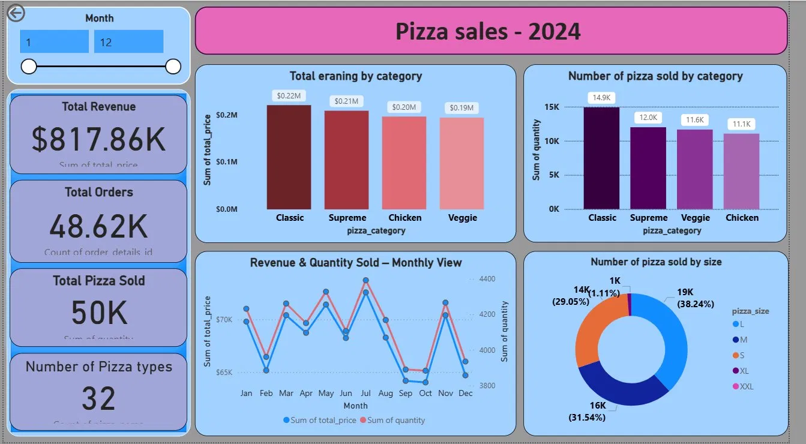
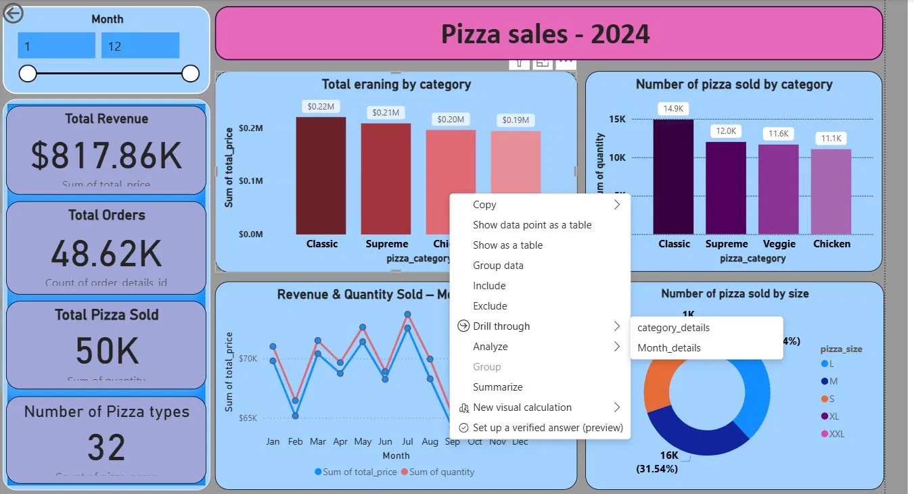
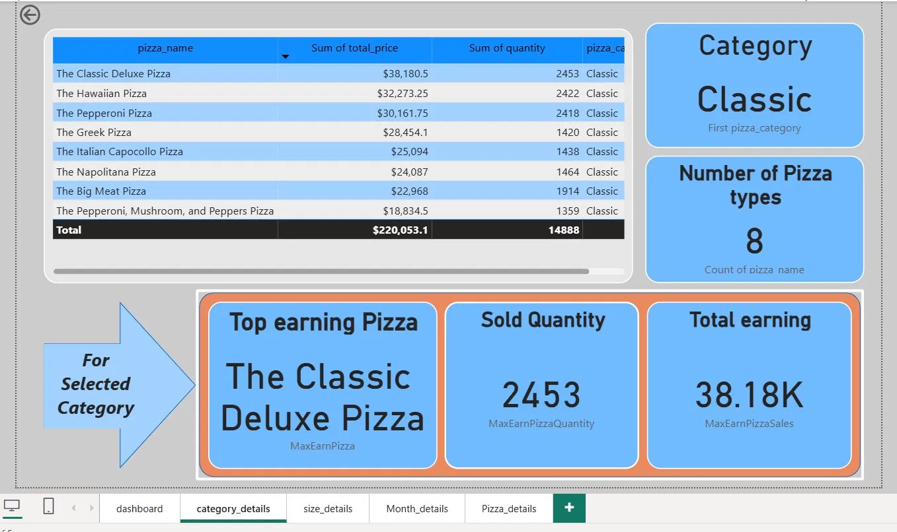
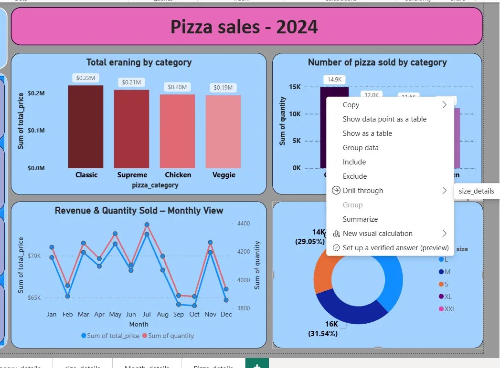
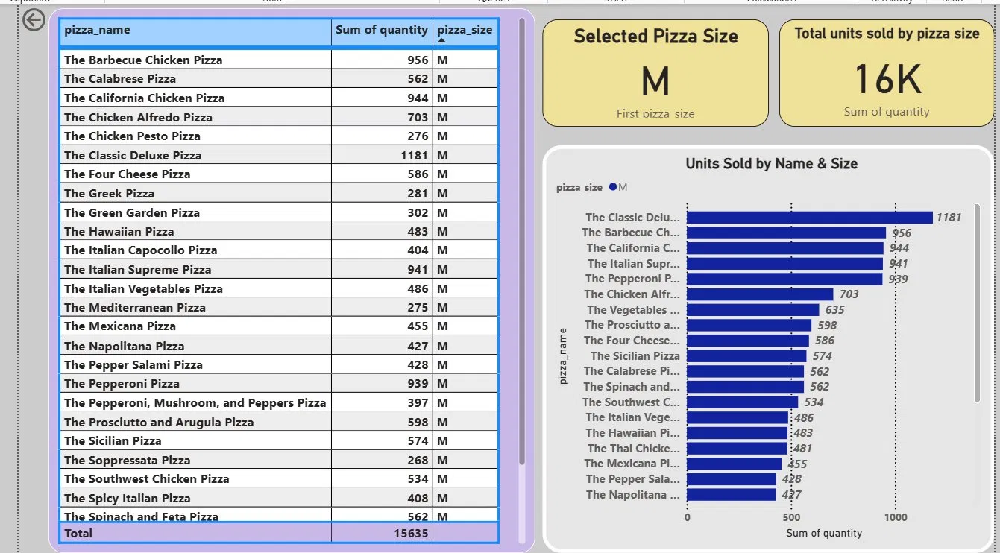
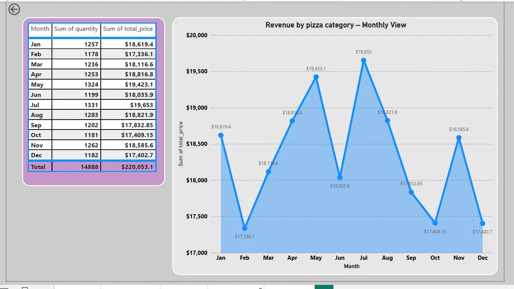

# 🍕 Pizza Sales Dashboard - 2024

> An interactive Power BI dashboard analyzing pizza sales performance across categories, sizes, and monthly trends.

---

## Dashboard Preview



> *Main dashboard showing key KPIs and visual breakdowns*

---

## Key Metrics

| Metric | Value |
|--------|-------|
| Total Revenue | $817.86K |
| Total Orders | 48.62K |
| Total Pizza Sold | 50K |
| Pizza Types | 32 |

---

## Dashboard Pages

### 1. Main Dashboard
Overview of all KPIs with monthly revenue & quantity trends, category earnings, and size distribution.

> 🎛️ **Time Slicer** — The main dashboard includes an interactive **Month Slicer (1–12)** that filters all visuals dynamically. Drag the slider to select any month range and instantly see how revenue, orders, and quantities change across the selected period.


### 2. Category Details
Drill-through page showing detailed breakdown by pizza category with top earning pizza per category.



Pizza category detail page:



### 3. Size Details
Detailed view of units sold by pizza size with individual pizza performance charts.



Pizza size detail page:



### 4. Month Details
Drill-through page showing detailed monthly breakdown by pizza category.


Monthly revenue breakdown by pizza category with trend line analysis:



---
## 🧮 DAX Measures

### MaxEarnPizza
Returns the name of the highest earning pizza based on total sales revenue.

```dax
MaxEarnPizza = 
CALCULATE (
    FIRSTNONBLANK ( Sheet1[pizza_name], 1 ),
    TOPN (
        1,
        SUMMARIZE (
            Sheet1,
            Sheet1[pizza_name],
            "TotalEarn", SUM ( Sheet1[total_price] )
        ),
        [TotalEarn], DESC
    )
)
```

### MaxEarnPizzaSales
Returns the total sales revenue of the highest earning pizza.

```dax
MaxEarnPizzaSales = 
CALCULATE (
    SUM ( Sheet1[total_price] ),
    FILTER (
        Sheet1,
        Sheet1[pizza_name] =
            CALCULATE (
                FIRSTNONBLANK ( Sheet1[pizza_name], 1 ),
                TOPN (
                    1,
                    SUMMARIZE (
                        Sheet1,
                        Sheet1[pizza_name],
                        "TotalEarn", SUM ( Sheet1[total_price] )
                    ),
                    [TotalEarn], DESC
                )
            )
    )
)
```

> These two measures work together to dynamically highlight the **top earning pizza** on drill-through pages. When combined with the **Month Slicer**, they update in real time to show the best performer for any selected time period.

---

## 🛠️ Tools Used


- **Power BI Desktop** - Dashboard creation & data visualization
- **DAX** - Custom measures and calculations
- **Power Query** - Data transformation and cleaning

---

## 📂 Features

- ✅ Interactive **Month Slicer** — filter any range from Jan (1) to Dec (12)
- ✅ **Drill-through** pages for deep-dive analysis by category, size, and month
- ✅ KPI cards for quick metrics overview
- ✅ Bar charts, line charts, donut charts
- ✅ **Dynamic top pizza** highlight using DAX (`MaxEarnPizza` & `MaxEarnPizzaSales`)

---

## 🚀 How to Use

1. Download the `.pbix` file from this repository
2. Open with **Power BI Desktop** (free download at [powerbi.microsoft.com](https://powerbi.microsoft.com))
3. Use the **Month Slicer** on the main dashboard to filter by time period
4. **Right-click** any chart bar → **Drill through** to see detailed pages
5. Use the **back arrow** (↩) to return to the main dashboard

## Power BI Dashboard Demo

[](https://drive.google.com/file/d/1WIV283yPuLmrXpQIlJHKZGtKuk_e1z_5/view?usp=sharing)

▶ Click the image above to watch the dashboard demo.

## Access to Project Files

Due to project and data-sharing considerations, the Power BI (.pbix) file is not publicly available.

A dashboard walkthrough video and screenshots are provided in this repository. Please feel free to contact me if you would like additional details or a live demonstration.

## 📧 Contact

**Dinusha Priyshan**
- 📧 dinushapriyshanedu@gmail.com
- 💼 [LinkedIn](https://www.linkedin.com/in/dinusha-priyashan-haputhanthiri-7b35b8379)
---

*Built with using Power BI Desktop*
